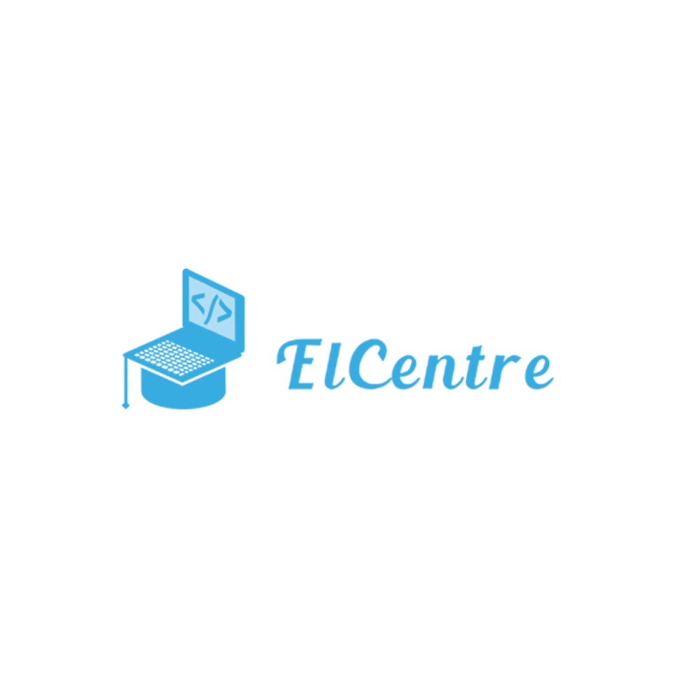
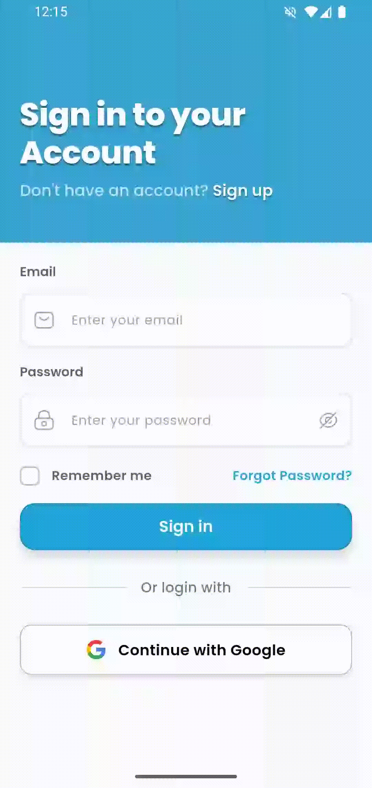
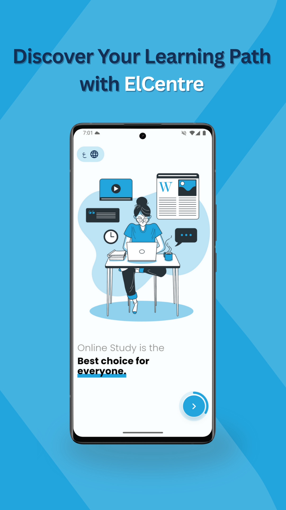
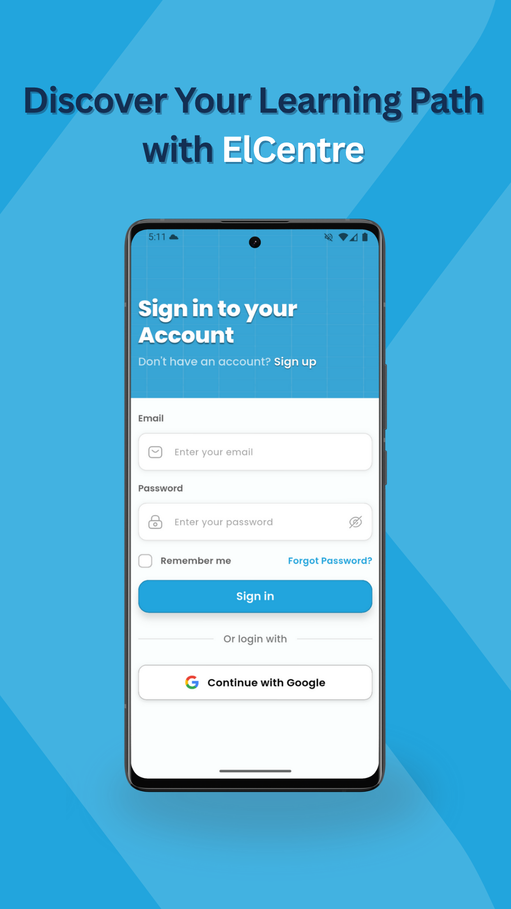
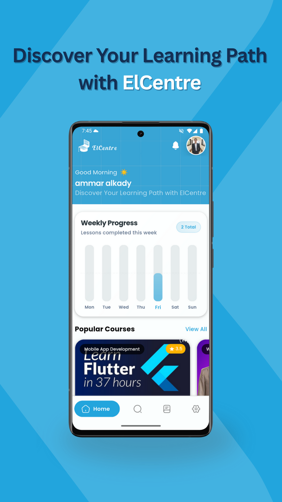
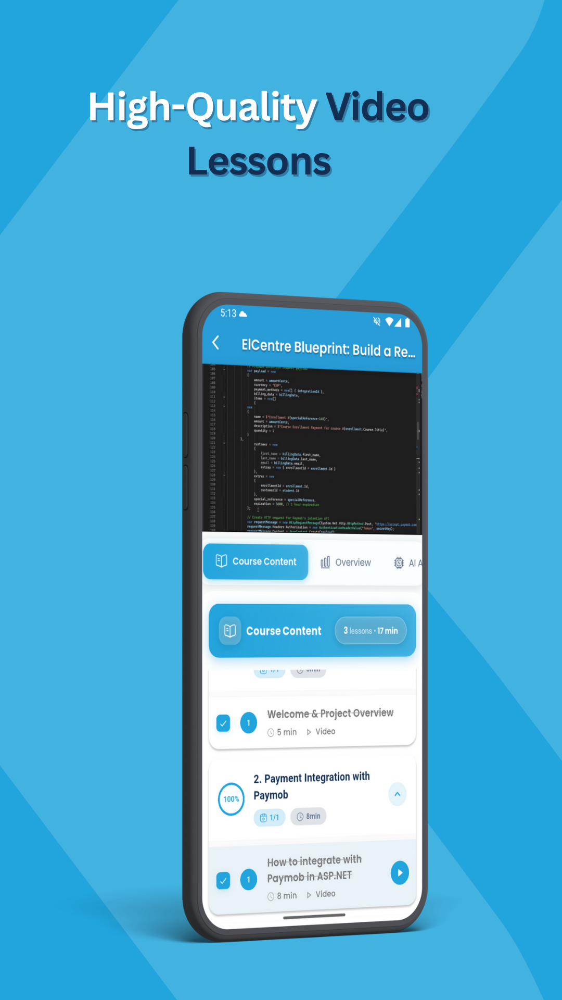
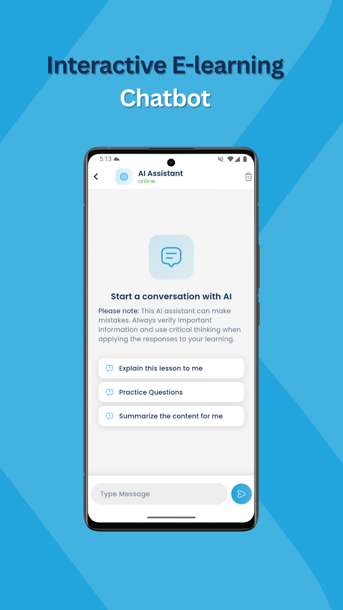
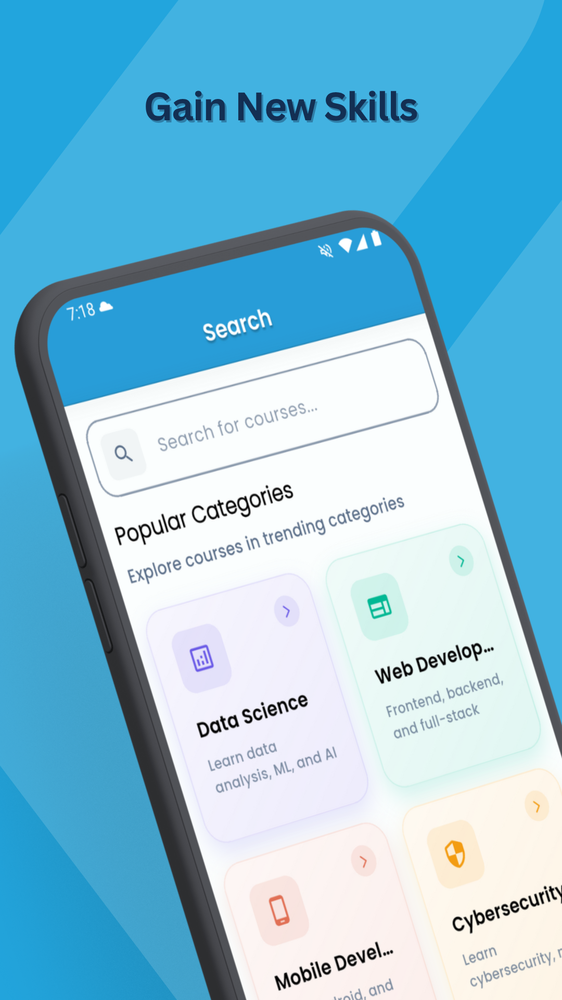

# 📱 ElCenter Mobile App

<p align="center">
  
</p>

<p align="center">
  <strong>Discover Your Learning Path with ElCenter</strong><br>
  Unlock your potential with expert-led courses. Learn at your own pace and achieve your goals with structured, AI-powered learning paths.
</p>

<div align="center">
  
  
  
  
  
</div>

---

## 🧭 Table of Contents

- [📱 App Demo Preview](#-app-demo-preview)
- [📘 About the Project](#-about-the-project)
- [✨ Key Features](#-key-features)
- [🛠 Tech Stack](#-tech-stack)
- [📂 Project Structure](#-project-structure)
- [⚙️ Getting Started](#️-getting-started)
- [🖼 Screenshots](#-screenshots)
- [🔗 Related Repositories](#-related-repositories)
- [📞 Contact](#-contact)

---

## 📱 App Demo Preview

<p align="center">
  
</p>

> **Note:** Experience the future of mobile learning with AI-powered assistance and intuitive course navigation.

---

## 📘 About the Project

**ElCenter** is a cutting-edge AI-powered e-learning platform designed to revolutionize how students learn. By combining interactive lessons, intelligent AI assistance, and personalized learning paths, ElCenter creates an engaging educational experience tailored to each learner's needs.

This repository contains the **Flutter mobile application** — the primary interface where students can:

- Access comprehensive course libraries
- Take interactive exams and assessments
- Interact with an AI-powered learning assistant
- Track their progress and achievements
- Learn on-the-go with audio mode

### 🎯 Project Goals

- **Accessibility:** Make quality education available to everyone, anywhere
- **Personalization:** Adapt learning experiences to individual student needs
- **Engagement:** Create interactive and motivating learning environments
- **Intelligence:** Leverage AI to provide instant help and smart recommendations

---

## ✨ Key Features

### 🔐 **Authentication & Security**

- Social login integration (Google)
- Password recovery and email verification
- Persistent session management

### 🤖 **AI Chat Assistant**

- Powered by Groq API for intelligent responses
- Context-aware conversation handling
- Multilingual support
- Course-specific Q&A assistance
- Learning recommendations

### 🎓 **Learning Experience**

- **Structured Courses:** Organized learning paths with modules and lessons
- **Interactive Content:** Videos, articles, quizzes, and practical exercises
- **Progress Tracking:** Visual dashboards showing completion and achievements
- **Bookmarks:** Save important lessons for quick access

### 📝 **Assessments & Exams**

- Multiple question types (MCQ, True/False, Essay)
- Instant feedback and detailed explanations
- Performance analytics and improvement suggestions

---

## 🛠 Tech Stack

### **Core Technologies**

| Technology                                                                                      | Purpose                  | Version |
| ----------------------------------------------------------------------------------------------- | ------------------------ | ------- |
|  | Cross-platform framework | 3.24+   |
|           | Programming language     | 3.5+    |

### **Backend & APIs**

- **REST API:** Custom backend integration
- **Groq AI API:** Intelligent chat assistant
- **Firebase Services:**
  - Authentication
  - Distribution

### **State Management & Architecture**

- **BLoC Pattern:** Business logic component architecture
- **Clean Architecture:** Separation of concerns and scalability

### **Key Packages**

```yaml
dependencies:
  # Core
  flutter_bloc: ^9.1.1 # BLoC pattern for state management
  get_it: ^8.0.3 # Service locator

  # Networking
  dio: ^5.8.0+1 # HTTP client
  retrofit: ^4.7.1 # Type-safe REST client
  pretty_dio_logger: ^1.4.0 # Network logging

  # Firebase
  firebase_core: ^4.2.0 # Firebase SDK

  # AI Integration
  groq: ^1.0.0 # Groq AI API

  # UI/UX
  flutter_svg: ^2.0.9
  cached_network_image: ^3.3.0
  shimmer: ^3.0.0

  # Media
  video_player: ^2.10.0 # Video playback
  chewie: ^1.12.1 # Video player UI
  image_picker: ^1.1.2 # Pick images/videos

  # Charts & Data Visualization
  fl_chart: ^1.1.1 # Beautiful charts
  percent_indicator: ^4.2.5 # Progress indicators

  # Storage
  shared_preferences: ^2.5.3 # Key-value storage

  # Localization
  easy_localization: ^3.0.3
```

---

## 📂 Project Structure

```
lib/
├── 📁 core/
│   ├── constants/          # App-wide constants
│   ├── errors/             # Error handling
│   ├── network/            # API client configuration
│   ├── themes/             # App themes and styles
│   └── utils/              # Helper functions and utilities
│
├── 📁 features/
│   ├── 🔐 auth/
│   │   ├── data/           # Data sources, models, repositories
│   │   └── presentation/   # UI, BLoC, widgets
│   │
│   ├── 🤖 chat/
│   │   ├── data/
│   │   └── presentation/
│   │
│   ├── 📚 courses/
│   │   ├── data/
│   │   └── presentation/
│   │
│   ├── 📝 exams/
│   │   ├── data/
│   │   └── presentation/
│   │
│   └── 👤 profile/
│       ├── data/
│       └── presentation/
│
├── 📁 services/            # Third-party integrations
│   ├── firebase_service.dart
│   ├── audio_service.dart
│   └── notification_service.dart
│
├── 📁 shared/
│   ├── widgets/            # Reusable widgets
│   └── extensions/         # Dart extensions
│
├── 📁 config/
│   ├── routes/             # Navigation configuration
│   ├── dependencies/       # Dependency injection
│   └── environment/        # Environment variables
│
└── main.dart               # App entry point
```

---

## ⚙️ Getting Started

### Prerequisites

Before you begin, ensure you have the following installed:

- **Flutter SDK:** Version 3.24 or higher ([Install Flutter](https://flutter.dev/docs/get-started/install))
- **Dart SDK:** Version 3.5 or higher (included with Flutter)
- **Android Studio** or **VS Code** with Flutter extensions
- **Git:** For version control
- **Firebase CLI:** For Firebase configuration (optional)

### Installation

1. **Clone the Repository**

   ```bash
   git clone https://github.com/AmmarAlkady49/el-center.git
   cd elcenter-mobile
   ```

2. **Install Dependencies**

   ```bash
   flutter pub get
   ```

3. **Generate Required Files**
   ```bash
   # Generate code for dependency injection, JSON serialization, etc.
   flutter pub run build_runner build --delete-conflicting-outputs
   ```

---

## 🖼 Screenshots

<p align="center">
  
  
  
    

</p>

<p align="center">
  
  
</p>

---

## 🔗 Related Repositories

| Repository          | Description           | Link                                                                          |
| ------------------- | --------------------- | ----------------------------------------------------------------------------- |
| 🖥 **Backend API**   | C#/.Net backend       | [View Repository](https://github.com/WalidTawfik1/elcentre-learning-platfrom) |
| 🌐 **Web Platform** | React web application | [View Website](https://elcentre-learn.vercel.app/)                            |

---

## 📞 Contact

<p align="center">
  <strong>Ammar AlKady</strong><br>
  Lead Developer & Project Maintainer
</p>

<p align="center">
  <a href="mailto:ammaralkady49@gmail.com">
    
  </a>
  <a href="https://www.linkedin.com/in/ammar-alkady-97417b273/">
    
  </a>
  <a href="https://github.com/AmmarAlkady49">
    
  </a>
  <a href="https://www.behance.net/gallery/228592763/AI-Powered-E-commerce-App">
    
  </a>
</p>

---

## 🌟 Support the Project

If you find this project helpful, please consider:

<p align="center">
  <a href="https://github.com/AmmarAlkady49/el-center">
    
  </a>
  <a href="https://github.com/AmmarAlkady49/el-center/fork">
    
  </a>
</p>

⭐ **Starring this repository** — It helps others discover the project and motivates continued development

🐛 **Reporting bugs** — Help us improve by reporting issues

💡 **Suggesting features** — Share your ideas for new features

📖 **Improving documentation** — Help make our docs better

🔀 **Contributing code** — Submit pull requests for fixes or features

---

<p align="center">
  <strong>Built with ❤️ using Flutter, AI, and modern development practices</strong><br>
</p>

<p align="center">
  <a href="#-elcenter-mobile-app">⬆️ Back to Top</a>
</p>

---
